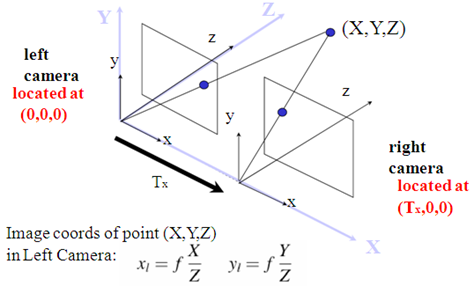
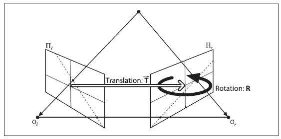

 [TOC]

 双目立体视觉的整体流程包括：图像获取、双目标定、双目矫正、立体匹配、三维重建。

* [Stereo Vision](https://sites.google.com/site/5kk73gpu2010/assignments/stereo-vision#TOC-Update-Disparity-Map)
* [OpenCV+OpenGL 双目立体视觉三维重建](https://blog.csdn.net/wangyaninglm/article/details/52142217)
* [OpenCV 双目测距（双目标定、双目校正和立体匹配）](https://blog.csdn.net/wangchao7281/article/details/52506691?locationNum=7)
* [真实场景的双目立体匹配（Stereo Matching）获取深度图详解](https://www.cnblogs.com/riddick/p/8486223.html)
* [Calculating a depth map from a stereo camera with OpenCV](https://albertarmea.com/post/opencv-stereo-camera/)
* [Stereo Vision Tutorial](http://mccormickml.com/2014/01/10/stereo-vision-tutorial-part-i/)
* [Literature Survey on Stereo Vision Disparity Map Algorithms](https://www.hindawi.com/journals/js/2016/8742920/)

-----

# 图像获取
双目相机拍摄获取 左右目图像

# 双目标定

|内参|外参|
|:-:|:-:|
|相机矩阵 $K_1, K_2$|旋转矩阵 $R$|
|畸变系数 $D_1, D_2$|平移向量 $T$|  
《Learning OpenCV》中对于 Translation 和 Rotation 的图示是这样的:   

# 双目矫正

通过 OpenCV函数 **stereoRectify**，包括 **畸变矫正** 和 **立体矫正** 。  

|输出参数|
|:-|  
|左目 矫正矩阵(旋转矩阵) $R_1$ (3x3)|
|右目 矫正矩阵(旋转矩阵) $R_2$ (3x3)|
|左目 投影矩阵 $P_1$ (3x4)|
|右目 投影矩阵 $P_2$ (3x4)|
|disparity-to-depth 映射矩阵 $Q$ (4x4)|

其中，

$$
\begin{aligned}
	P_1 =
	\begin{bmatrix}
	f & 0 & c_x & 0 \\
	0 & f & c_y & 0 \\
	0 & 0 & 1   & 0
	\end{bmatrix}
\end{aligned}
$$

$$
\begin{aligned}
	P_2 =
	\begin{bmatrix}
	f & 0 & c_x & T_x \cdot f \\
	0 & f & c_y & 0 \\
	0 & 0 & 1   & 0
	\end{bmatrix}
\end{aligned}
$$

通过 $P_2$ 可计算出 **基线** 长度:
$$
\begin{aligned}
    baseline = - T_x = - \frac{{P_2}_{03}}{f_x}
\end{aligned}
$$

* [ethz-asl/image_undistort](https://github.com/ethz-asl/image_undistort): A compact package for undistorting images directly from kalibr calibration files. Can also perform dense stereo estimation.

# 立体匹配

## 视差计算
通过 OpenCV函数 **stereoBM** (block matching algorithm)，生成 **视差图(Disparity Map)** (CV_16S or CV_32F)

> disparity map from stereoBM of OpenCV :
> It has the same size as the input images. When disptype==CV_16S, the map is a 16-bit signed single-channel image, containing disparity values scaled by 16. To get the true disparity values from such fixed-point representation, you will need to divide each disp element by 16. If disptype==CV_32F, the disparity map will already contain the real disparity values on output.

So if you've chosen **disptype = CV_16S** during computation, you can access a pixel at pixel-position (X,Y) by: `short pixVal = disparity.at<short>(Y,X);`, while the disparity value is `float disparity = pixVal / 16.0f;`; if you've chosen **disptype = CV_32F** during computation, you can access the disparity directly: `float disparity = disparity.at<float>(Y,X);`

* [Disparity Map](http://www.jayrambhia.com/blog/disparity-mpas)
* [Disparity map post-filtering](https://docs.opencv.org/3.1.0/d3/d14/tutorial_ximgproc_disparity_filtering.html)

# 三维重建

## 深度计算

深度计算公式如下，通过遍历图像生成 **深度图**
$$
\begin{aligned}
	Z = depth = \frac{f_x \cdot baseline}{disparity}
\end{aligned}
$$
其中，$disparity$ 代表 视差图 坐标值  

### 图像类型
* 单位meter --> 32FC1
* 单位millimeter --> 16UC1

## 三维点坐标计算
* 根据 **小孔成像模型**，已知 $Z$ 和 **相机内参** 可计算出 三维点坐标，从而生成 **三维点云**
$$
\begin{aligned}
	\begin{cases}
	Z = depth \\
	X = \frac{u-c_x}{f_x} \cdot Z \\
	Y = \frac{v-c_y}{f_y} \cdot Z
	\end{cases}
\end{aligned}
$$
